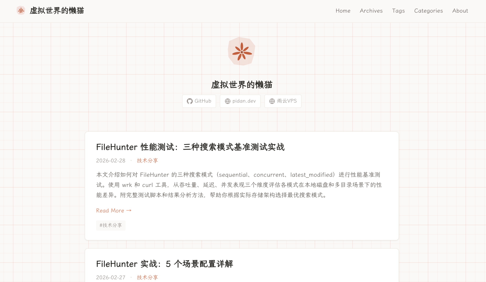
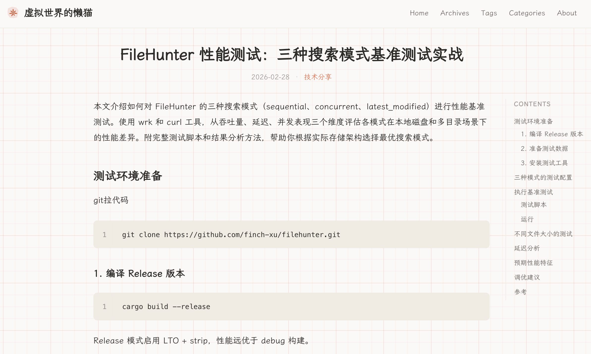

<div align="center">
  
  <h1>hexo-theme-warmpaper</h1>
  <p><em>"8000 years ago, a Halafian potter painted the same radiating pattern that an AI company would choose as its logo — some visual instincts are older than civilization itself."</em></p>
  <p>A warm Hexo blog theme inspired by Claude's color palette.<br>Beige background with a subtle orange grid-paper texture for an immersive reading experience.</p>

  [](LICENSE)
  [](https://hexo.io)
  [](https://nodejs.org)
  [](https://github.com/finch-xu/hexo-theme-warmpaper)

  **Live Demo**: [pidan.dev](https://pidan.dev) | [中文](README.md)
</div>

<table>
  <tr>
    <td></td>
    <td></td>
  </tr>
</table>

---

## Features

- Claude-inspired color scheme (warm beige + orange accent)
- Subtle orange grid-paper background texture
- Single-column post layout + sticky TOC sidebar with scroll tracking
- Card-style post list on homepage
- Responsive design (TOC auto-hides on mobile)
- LXGW WenKai GB font (CDN with subset loading)

## Installation

Clone the theme into your Hexo blog's `themes` directory:

```bash
cd your-hexo-blog
git clone https://github.com/finch-xu/hexo-theme-warmpaper.git themes/warmpaper
```

Install the EJS renderer (if not already installed):

```bash
npm install hexo-renderer-ejs --save
```

Enable the theme in your blog's root `_config.yml`:

```yaml
theme: warmpaper
```

## Development

### Prerequisites

- Node.js >= 14
- Hexo CLI (`npm install -g hexo-cli`)

### Setting Up

1. Create a test Hexo blog:

```bash
hexo init hexo-test-blog
cd hexo-test-blog
npm install
npm install hexo-renderer-ejs --save
```

2. Link the theme to the blog's themes directory:

```bash
# Option 1: Symlink (recommended, changes apply instantly)
ln -s /path/to/hexo-theme-warmpaper themes/warmpaper

# Option 2: Clone directly
git clone https://github.com/finch-xu/hexo-theme-warmpaper.git themes/warmpaper
```

3. Update the blog's `_config.yml`:

```yaml
theme: warmpaper
```

4. Create test posts (include multi-level headings to test TOC):

```bash
hexo new post "Test Post"
```

### Dev Server

```bash
hexo clean && hexo server
```

Visit `http://localhost:4000` to preview. Refresh after modifying theme files.

### Common Commands

```bash
# Clear cache (recommended after template changes)
hexo clean

# Start local preview server
hexo server

# Start server with drafts visible
hexo server --draft

# Generate static files
hexo generate

# Clean + generate + preview (all-in-one)
hexo clean && hexo generate && hexo server
```

### Static Preview

The project includes `preview.html` which can be opened directly in a browser to preview the theme's visual style without a Hexo setup.

## Build & Deploy

Generate static files:

```bash
hexo clean && hexo generate
```

Generated files are in the `public/` directory, deployable to any static hosting service (GitHub Pages, Vercel, Netlify, etc.).

### Deploy to GitHub Pages

```bash
npm install hexo-deployer-git --save
```

Configure in your blog's `_config.yml`:

```yaml
deploy:
  type: git
  repo: https://github.com/your-username/your-username.github.io.git
  branch: main
```

Deploy:

```bash
hexo clean && hexo deploy
```

## Theme Configuration

Edit `_config.yml` in the theme directory:

```yaml
# Navigation menu
menu:
  Home: /
  Archives: /archives

# Profile card (above post list on homepage)
profile:
  avatar: /images/avatar.png     # Avatar image path
  description: "A short bio"     # Bio text
  links:                         # Social links (any number)
    - name: GitHub
      url: https://github.com/yourname
      icon: github               # Supported: github, email, website, twitter, rss, bilibili, zhihu
    - name: Email
      url: mailto:your@email.com
      icon: email
    - name: Website
      url: https://yoursite.com
      icon: website

# Table of Contents (right sidebar)
toc:
  enable: true
  max_depth: 3
  min_depth: 2
  list_number: false

# Post excerpt link text
excerpt_link: Read More

# Footer copyright (leave empty for default)
copyright: ""
```

## Directory Structure

```
hexo-theme-warmpaper/
├── _config.yml              # Theme configuration
├── package.json
├── layout/
│   ├── layout.ejs           # Base HTML skeleton
│   ├── index.ejs            # Homepage
│   ├── post.ejs             # Post detail page
│   ├── page.ejs             # Standalone page
│   ├── archive.ejs          # Archive page
│   ├── category.ejs         # Category page
│   ├── tag.ejs              # Tag page
│   └── partial/
│       ├── head.ejs         # HTML head
│       ├── header.ejs       # Navigation bar
│       ├── footer.ejs       # Footer
│       ├── profile.ejs      # Profile card
│       ├── post-card.ejs    # Post card
│       ├── pagination.ejs   # Pagination
│       └── toc.ejs          # TOC sidebar
└── source/
    ├── css/
    │   └── style.css        # Main stylesheet
    ├── images/
    │   └── logo.svg         # Default theme logo
    └── js/
        └── main.js          # TOC scroll tracking
```

## Fonts

This theme uses the following external font resources:

### LXGW WenKai GB

An open-source Kai-style font used for site-wide typography, derived from FONTWORKS Klee One, conforming to mainland China G-source glyph standards.

- **Font repo**: https://github.com/lxgw/LxgwWenkaiGB
- **Webfont subsets**: https://github.com/CMBill/lxgw-wenkai-gb-web
- **CDN (Regular)**: https://cdn.jsdelivr.net/npm/lxgw-wenkai-gb-web@latest/lxgwwenkaigb-regular/result.css
- **CDN (Medium)**: https://cdn.jsdelivr.net/npm/lxgw-wenkai-gb-web@latest/lxgwwenkaigb-medium/result.css
- **Font license**: [SIL Open Font License 1.1](https://openfontlicense.org/)

## License

Theme code is released under the [MIT License](LICENSE).

Referenced font resources are licensed under the [SIL Open Font License 1.1](https://openfontlicense.org/).
